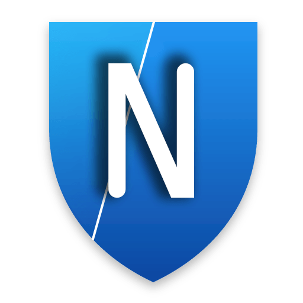

  
  <h1>نوا رادار</h1>
  
<strong>اسکنر IP کلودفلر — اپلیکیشن دسکتاپ</strong>

  

    <a href="README.md">English</a>
  

  

    
    
    
    
  

---

## معرفی

نوا رادار یک **اسکنر IP دسکتاپ** است که با [Wails v3](https://wails.io) (بک‌اند گو + فرانت ری‌اکت/تایپ‌اسکریپت) ساخته شده. این برنامه رنج‌های IP کلودفلر را از منابع متعدد اسکن می‌کند، تأیید پروتکل واقعی (TCP + TLS handshake) انجام می‌دهد و IPهای سالم را مرتب‌شده بر اساس سرعت تحویل می‌دهد.

> ساخته شده توسط [**گروه نوا پروکسی**](https://github.com/IRNova)

## ویژگی‌ها

- **اسکن چندمنبعی** — ۹ منبع IP قابل انتخاب (رسمی کلودفلر، AS13335، AS209242، AS24429، AS199524، لیست CM، پراکسی معکوس، دامنه خارج و ایران)
- **تأیید دو مرحله‌ای** — اسکن سریع TCP → تست عمیق TLS (۳ تلاش، قبولی ≥۲)
- **مرتب‌سازی بر اساس سرعت** — نتایج بر اساس زمان پاسخ (سریع‌ترین اول)
- **پیشرفت زنده** — نمایش IP جاری، نوار پیشرفت، زمان تخمینی، تعداد اسکن شده/زنده/مرده
- **انتخاب پورت** — ۱۲ پورت (443، 2053، 2083، 2087، 2096، 8443، 80، 2052، 2082، 2086، 2095، 8080)
- **خروجی نتایج** — کپی به کلیپ‌بورد یا ذخیره در فایل `.txt`
- **تم تاریک** — UI تاریک و شیک با رادار متحرک
- **پنجره بدون فریم** — نوار عنوان اختصاصی با سیستم تری

## نحوه کار

1. **دریافت منابع** — در شروع اسکن، منابع IP فعال به صورت موازی از گیت‌هاب دریافت می‌شوند
2. **تولید IP** — IPهای تصادفی از رنج‌های CIDR تولید می‌شوند (حداکثر ۵۱۲ تا)
3. **اسکن سریع (فاز ۱)** — اتصال TCP به هر IP:پورت با آفست تصادفی (۸۰۰ کارگر همزمان)
4. **تست عمیق (فاز ۲)** — تأیید TLS برای پورت‌های امن، خوانش TCP برای پورت‌های HTTP (۳ تلاش، قبولی ≥۲)
5. **مرتب‌سازی** — IPهای سالم بر اساس سرعت مرتب می‌شوند

## منابع IP

| منبع | نوع | توضیحات |
|------|------|-------------|
| Cloudflare Official | CIDR | `cloudflare.com/ips-v4` |
| لیست CM | CIDR | لیست CIDR کلودفلر |
| AS13335 | CIDR | ASN کلودفلر |
| AS209242 | CIDR | ASN کلودفلر |
| AS24429 | CIDR | ASN علی‌بابا |
| AS199524 | CIDR | ASN G-Core |
| آی‌پی پراکسی معکوس | Proxy IP | آی‌پی‌های پراکسی عمومی |
| دامنه خارج | Domain | دامنه‌های خارجی |
| دامنه ایران | Domain | دامنه‌های ایرانی |

---

  <h3>حمایت از پروژه</h3>
  
از اینجا مارو با دونیت کردن حمایت کنید

  
<a href="https://daramet.com/NovaPr" target="_blank">🔗 https://daramet.com/NovaPr</a>

  

  <h4>کیف پول‌ها</h4>
  
<strong>BTC:</strong>

  <pre><code>bc1qc54su3gz20ulq8df7k0pcskk4zz4sy0e7z7hws</code></pre>
  
<strong>TON:</strong>

  <pre><code>UQD51lGC35rP_SbVYgbFA7CEEii4GVMFgqj4N8fiGi6m425w</code></pre>

---

## ستاره‌ها در طول زمان

## لایسنس

این پروژه فقط برای اهداف آموزشی است.

---

  <a href="https://github.com/IRNova">گیت‌هاب</a> •
  <a href="https://t.me/irnova_proxy">کانال تلگرام</a> •
  <a href="https://t.me/irnovaproxy">نویسنده</a>

